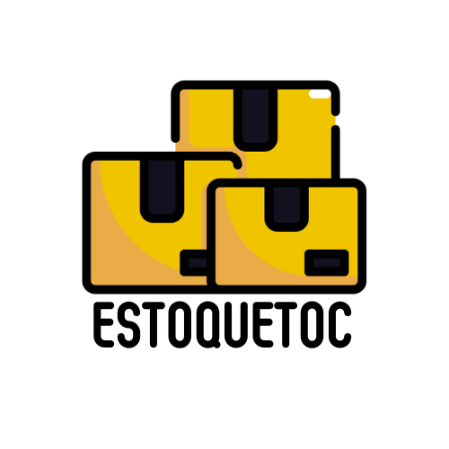

# EstoqueToc


<p align="center">
    
   <p align="center">Gerenciando seu estoque com precisão e eficiência.</p>
</p>

## Veja os outros ReadMe do projeto EstoqueToc:
🔗 [Documentação](https://github.com/EstoqueToc/Documentation)   🔗 [Front-End](https://github.com/EstoqueToc/FrontEnd)  🔗 [Back-End](https://github.com/EstoqueToc/BackEnd)

## Projeto
O EstoqueToc é um projeto desenvolvido em grupo na São Paulo Tech School, focado no gerenciamento de estoque para pequenas e médias empresas. </br>
Nosso objetivo é oferecer soluções eficientes e personalizadas para otimizar a gestão de inventário, proporcionando uma vantagem competitiva aos nossos clientes.

## Face do projeto
- aqui tem que ter fotos do projeto

## Pré-Requisitos
Antes de começar, é necessário ter o Node.js instalado em sua máquina, e um editor de códigos.

## Instalação
1. Clonar repositório
```bash
git clone <URL do repositório>
```
3. Abrir um editor de códigos com o repositório
4. Abrir o terminal do editor ou abrir o cmd dentro do repositório
5. Execute os comandos abaixo
```bash
# Instalar todas as dependências do projeto
tal comando
```
```bash
# Executar a aplicação
tal comando
```
